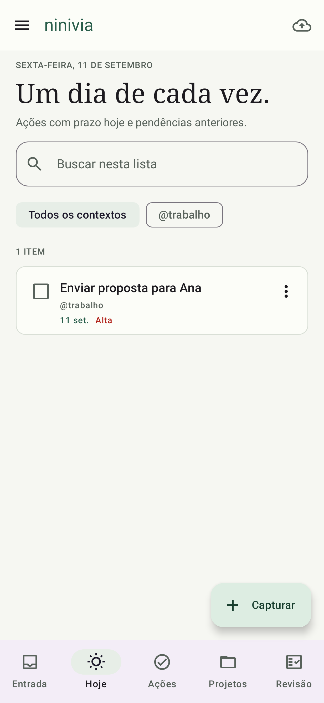

# Ninivia

Notas e ações pessoais com o método GTD. Aplicativo Android nativo em Kotlin e Jetpack Compose, em português, com tema claro e escuro.



Validação local: **22 testes aprovados e Android Lint sem erros**. Detalhes e limites em [VALIDACAO.md](docs/VALIDACAO.md).

## Usar o aplicativo

1. **Capture** uma ideia, tarefa ou nota na Entrada. O editor salva alterações automaticamente.
2. **Esclareça** o significado: Próximas ações, Aguardando, Algum dia ou Referência.
3. Associe ações a um **projeto** quando o resultado exigir várias etapas. Registre o resultado esperado.
4. Escolha **contexto**, prioridade, prazo, etiquetas e checklist quando forem úteis.
5. Use **Hoje** para ações com prazo hoje ou atrasadas. Referências e ideias não são compromissos do dia.
6. Faça a **revisão semanal** em cinco passos. O progresso é salvo entre sessões.
7. Exporte periodicamente um **backup protegido por senha** pelo menu.

Recorrências diárias, semanais e mensais geram uma próxima ocorrência ao concluir a atual. Datas são dias de calendário locais. Tarefas atrasadas repetem a partir da conclusão, evitando gerar uma fila de ocorrências antigas. Reabrir e concluir novamente a mesma tarefa não cria outra cópia.

A lixeira não é esvaziada automaticamente. A exclusão permanente exige confirmação.

## Android e instalação

Requer **Android 8.0 (API 26) ou mais recente**. Não exige conta, Firebase ou acesso à internet.

O APK de desenvolvimento é produzido em `app/build/outputs/apk/debug/app-debug.apk`. Transfira para o celular, abra o arquivo e permita a instalação pelo aplicativo usado para abri-lo.

A identidade original `com.aistudio.securenotes.dxpzaf` foi mantida. Atualizar uma instalação existente exige **a mesma chave de assinatura**. Uma assinatura de desenvolvimento diferente pode causar “App não instalado”; não desinstale a versão anterior se houver dados que precise preservar. Uma versão publicada na Play Store exige assinatura de produção e validação no dispositivo.

## Compilar e verificar

Requisitos: JDK 17 ou superior, SDK Android 36 e Build Tools 36.0.0. O Gradle Wrapper está incluído.

No Windows com Android Studio instalado:

```powershell
.\scripts\build.ps1
```

Em qualquer ambiente configurado com `JAVA_HOME` e `ANDROID_HOME`:

```sh
./gradlew testDebugUnitTest lintDebug assembleDebug
```

A versão release usa R8 e é gerada sem credenciais de assinatura embutidas. Configure uma assinatura externa para distribuir atualizações de produção. Nunca versione keystores ou senhas.

## Estrutura

- `data/`: entidades Room, migração v1 → v2, repositório transacional e regras GTD.
- `crypto/`: criptografia local e formato de backup portátil.
- `ui/`: Compose, ViewModels, editor, projetos, revisão e backup.
- `app/schemas/`: esquema Room versionado.
- `app/src/test/`: regras, banco, migração, backups e fluxos da interface.
- `docs/AUDITORIA.md`: revisão do projeto original e decisões.

## Dados e privacidade

O banco permanece no aparelho. Título, conteúdo e checklist usam AES-GCM com chave do Android Keystore. Metadados de organização (projetos, etiquetas, contexto, datas) e referências de anexos ficam no armazenamento privado do aplicativo; não são um banco integralmente cifrado.

A chave local não é transferível. Backups automáticos do banco pelo Android estão excluídos para evitar restaurar dados sem a chave correspondente. Use a exportação do Ninivia.

O backup `.ninivia` usa AES-256-GCM e PBKDF2-HMAC-SHA256 com 210.000 iterações, sal e nonce aleatórios. Não há recuperação de senha. A importação valida o arquivo antes de gravar e cria cópias, sem substituir notas atuais. Importar duas vezes cria duplicatas.

**Anexos não estão incluídos no backup.** Os novos anexos usam permissão persistente de leitura. Arquivos removidos, provedores indisponíveis e anexos da versão antiga sem permissão podem precisar ser selecionados novamente.

## Escopo desta versão

Inclui notas, organização GTD, projetos, busca, contextos, prioridades, prazos, recorrência, checklists, anexos, revisão e backup. Não inclui sincronização entre aparelhos, notificações de prazo, colaboração, widgets, integração com TickTick ou publicação na Play Store. Nenhuma dessas funções é apresentada como disponível no app.
